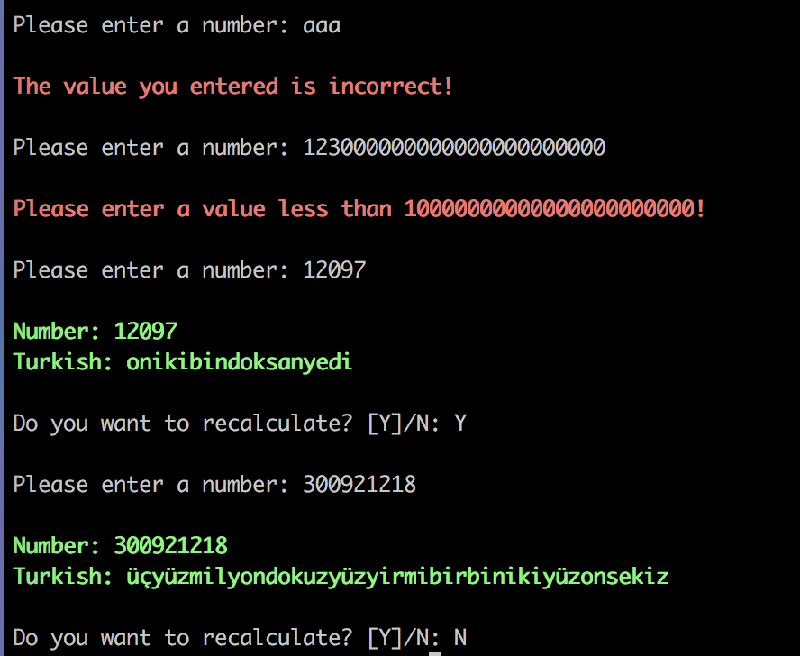

# Convert A Number To Text


## Requirements
* Python 3


## Installation
```shell
$ git clone https://github.com/kenansubasi/number-converter
```

## How to Run?
```shell
$ cd number-converter/number_converter
$ python main.py
```

## Test
```shell
$ cd number-converter/number_converter
$ python tests.py
```

## Features
* The number entered is converted into Turkish.


## Features to be added in the future
* English convert will be added.


## Screenshots



## Maintainer
Kenan Subaşı <kenansubasiceng@gmail.com>
