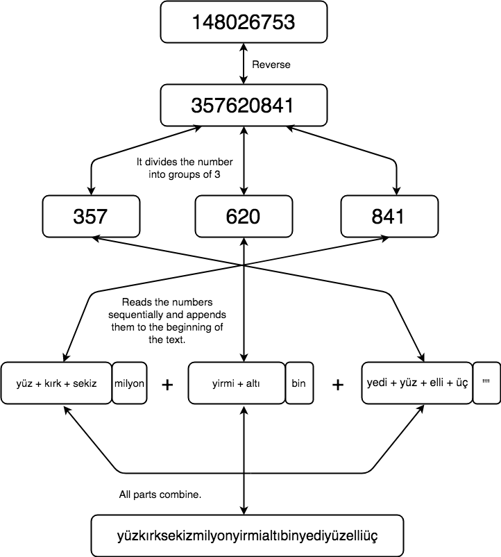

# Convert A Number To Text


## Requirements
* Python 3


## Installation
```shell
$ git clone https://github.com/kenansubasi/number-converter
```

## How to Run?
```shell
$ cd number-converter/number_converter
$ python3 main.py
```

## Test
```shell
$ cd number-converter/number_converter
$ python3 tests.py
```

## Features
* The number entered is converted into Turkish text.


## Features to be added in the future
* The module will be added to convert the number into English text.


## Flow Diagram



## Screenshots


## Maintainer
Kenan Subaşı <kenansubasiceng@gmail.com>
